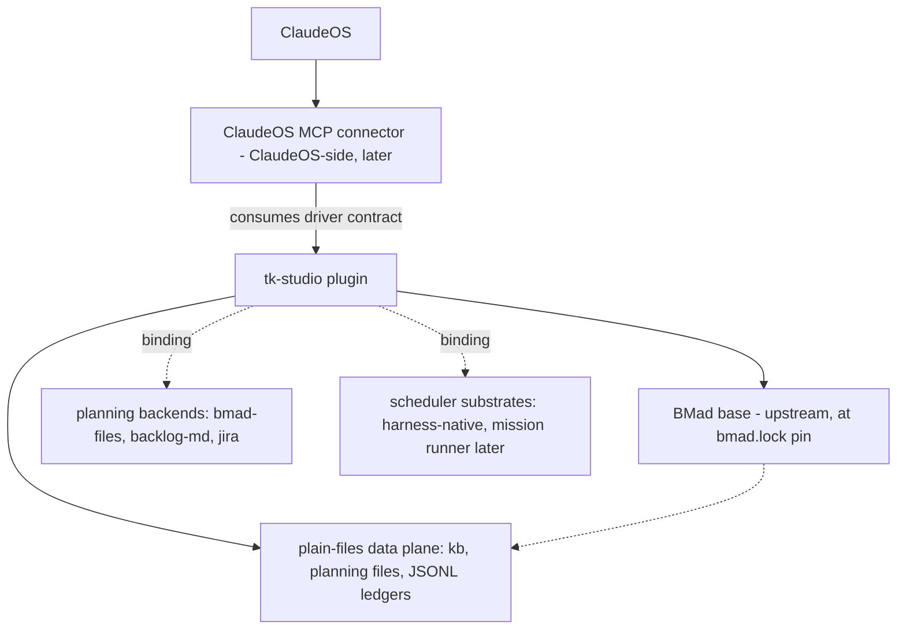

# Architecture Spine — tk-studio

## Design Paradigm

**Ports-and-adapters (hexagonal) over a plain-files data plane.** The core is orchestration logic plus canonical data contracts — frontmatter markdown and JSONL, readable by any agent with no runtime. Every variable external dependency is a named **binding** behind a port: planning backend, VCS, scheduler substrate, harness driver, persona shell. Bindings live in config; contracts stay canonical; adapters translate and never leak backend specifics inward.

| Port | Binding home | v1 adapters |
| --- | --- | --- |
| Planning backend | project config `planning.backend` | `bmad-files` (fallback, first-class), `backlog-md` (default), `jira` (first external) |
| VCS | project config `vcs` | `git` (default), `perforce` (first-class, conventions only in v1) |
| Scheduler substrate | studio default + project override | `harness-native` (default); ClaudeOS mission runner later, behind the driver contract |
| Harness driver | consumes the published driver contract | direct headless invocation (v1); ClaudeOS MCP connector (later, ClaudeOS-side) |
| Persona shell | attended sessions only | `council` shell over the stateless orchestrator core |

## Invariants & Rules

### AD-1 — Composite distribution (O1) `[ADOPTED]`

- **Binds:** all — Lockstep
- **Prevents:** per-developer unmanaged installs; a BMad fork
- **Rule:** tk-studio ships as a Claude Code plugin from this repo's git marketplace (`extraKnownMarketplaces` auto-prompt on folder trust). The BMad base is never vendored or forked: a committed `bmad.lock` pins the core version, the module set **with per-module version pins** (external modules — bmb, cis, gds, tea, wds, bmad-loop — version and channel independently of core), and install flags; install/update always runs the upstream installer at the pin (`npx bmad-method@<pin> install`, non-interactive). No bootstrap script in the repo (ruled 2026-07-26): clone + folder trust auto-prompts the plugin install, and the base install is plain `npx` — `tk install` is a plugin skill only. Base updates go through the base-update skill: bump the pin → run the upstream installer → open an **integration PR** for review (the reviewable upstream diff, without owning a fork). Ruled 2026-07-26 as the working answer: not re-litigated pre-build; revised only on measurement-loop evidence through the AD-12 consolidation channel.

### AD-2 — Layer dependency direction

- **Binds:** all
- **Prevents:** the studio coupling to one harness; ClaudeOS becoming a dependency
- **Rule:** tk-studio depends downward only (BMad, the local filesystem, the generic agent harness). It never imports, calls, or requires ClaudeOS. Upward integration exists only as the published **driver contract** (AD-11) that any harness may consume. Every studio capability must work with no ClaudeOS attached.



### AD-3 — Taxonomy placement: category → location → VCS

- **Binds:** all writes by any studio or wrapped skill
- **Prevents:** scratch in repos, team knowledge stranded per-machine, planning artifacts outside the bound backend
- **Rule:** every datum is classified before it is written; the category fixes location and version control. Working data → per-user store `~/.tk-studio/` (never on any VCS). Project knowledge → `{project-root}/kb/` (project's VCS). Studio data → this repo, delivered via the plugin (git, always). Planning data → wherever the project's planning binding says. **Credentials are a fifth, explicit class:** tokens/keys live only in the per-user store's local config, an OS credential store, or environment — never in any tracked file, kb, planning artifact, or measurement event; emission sanitization strips anything credential-shaped. A skill that cannot classify its write halts `blocked` rather than guessing.

### AD-4 — Planning access only through the adapter (O2)

- **Binds:** every skill touching epics/stories/tasks/sprint state
- **Prevents:** n skills × m backends integration surface; forked BMad skills
- **Rule:** O2 ruling — **file-plane sync layer.** Stock BMad planning skills stay untouched and read/write their native artifacts in `_bmad-output/`. The adapter — a standalone skill + library the orchestrator sequences around planning flows (or the user invokes directly) — owns **canonicalization**: its normalize pass stamps/repairs the AD-6 frontmatter on those artifacts after stock flows run (editing artifacts, never BMad code — the zero-fork line holds). The normalized `_bmad-output/` planning artifacts are the **single canonical local representation** under every binding. The adapter is also the **sole id-allocation authority** (AD-6 ids minted only from the committed per-project counter during normalize/sync; a detected duplicate blocks sync until renumbered). It alone talks to planning backends — no skill, studio or stock, ever calls a backend API/MCP directly, and nothing else writes canonical frontmatter keys.

### AD-5 — Sync semantics: one-way promote + status pull-back (O2)

- **Binds:** the planning adapter, every non-fallback backend — external (Jira) and local projection (Backlog.md) alike
- **Prevents:** bidirectional-merge conflict hell the research showed nobody has solved; two owners of one story
- **Rule:** canonical files → backend is **promote**; backend → canonical pulls **status-class fields only** (status, assignee, external key). Every bound backend, including the local `backlog/` projection, is a **projection of the canonical files, never authoritative** — a human edit in the kanban UI reaches canonical only as a status-class pull-back. Pull-back applies a backend change only when it differs from the state recorded at the last promote (**echo suppression** via the `external.<binding>` snapshot); when both sides changed since the last sync, that entity is a **human conflict**, never silently resolved. Mappings must be **round-trip stable**: a backend too coarse to represent a canonical status never overwrites the finer local value on an unchanged round trip. Content authored locally wins locally, always.

### AD-6 — Canonical interchange shape, versioned

- **Binds:** the adapter, all backend adapters, migration
- **Prevents:** incompatible entity shapes across backends; unmigratable data
- **Rule:** one entity per file, YAML frontmatter, `shape_version: 1`. Required: `id` (`EP-NNN`/`ST-NNN`/`TA-NNN`, stable, never reused), `type` (`epic|story|task`), `title`, `status` from the closed enum `draft|ready|in-progress|blocked|review|done|dropped`, `created`/`updated` (ISO-8601). Optional: `parent` (story→epic, task→story), `depends_on[]`, `priority` (`P0`–`P3`), `assignee`, `labels[]`, `external.<binding>: {key, synced_at, content_hash}`. Body is markdown; acceptance criteria as a `## Acceptance Criteria` checklist. Adapters **map** the enum onto backend states and never extend it; an unmappable backend state maps to the nearest canonical value with the original preserved under `external`. Epic has no native entity in Backlog.md (→ milestone + label) and no native entity in Linear (→ Project); in Jira epic→Epic, story→Story, task→Sub-task.

### AD-7 — First external backend: Jira via official Atlassian MCP (O3)

- **Binds:** planning adapter roadmap; Operations headless paths
- **Prevents:** betting the first integration on an unofficial bridge
- **Rule:** O3 ruling — the first external planning backend is **Jira (Atlassian Cloud)** through the official Atlassian Rovo MCP Server (formerly "Remote MCP"), shipped only after the local backends are stable, via the designed migration (AD-16). Headless flows MUST authenticate with API tokens, not OAuth (tk-council ISS-008: MCP OAuth cannot complete non-interactively); API-token access is an org-admin-enabled toggle — verifying it is enabled is part of the headless auth preflight (AD-11). The epic→Epic / story→Story / task→Sub-task mapping is the default — confirm against the target org's issue-type scheme at adapter build. Confluence publishing of `kb/` and Linear are later adapters under the same contract.

### AD-8 — Cross-project knowledge stays out of v1 (O4)

- **Binds:** Taxonomy, Recommendation evolve loop
- **Prevents:** building a canonical-KB subsystem before per-project KB has proven itself
- **Rule:** O4 ruling — **out.** Knowledge is per-project (`kb/`). Cross-project reads are served by the **project registry** in working data (the canonical path for "status of all projects") plus the Obsidian vault as the human window. The seam stays open: kb frontmatter reserves `scope:`, and the promotion-gate pattern (tk-council custodian membrane) is the named v2 mechanism. The evolve loop only observes and logs in v1.

### AD-9 — Stateless orchestrator core, optional persona shell (O5)

- **Binds:** the orchestrated entry point, all roles
- **Prevents:** identity/persona state entangled with routing logic (the tk-council lesson)
- **Rule:** O5 ruling — the orchestrator core is **stateless**: resolve role (from the per-user store) → resolve project working set (from project config) → route/convene/synthesize. The persona shell ("convene the council") is data — persona assets loaded only in attended sessions. Headless bypasses the shell entirely and must produce identical routing and artifacts. No sanctum/rebirth machinery in the studio core; that is tk-council overlay material.

### AD-10 — Job model is data; substrate executes (O8)

- **Binds:** Operations — loops, scheduled jobs
- **Prevents:** a bespoke runner the ecosystem will obsolete; jobs unportable across substrates
- **Rule:** O8 ruling — **hybrid.** A job is a declarative definition: `id`, target skill + payload, trigger (`one-shot|cron|loop`), cadence (fixed or self-paced), budget guards (tokens, turns, wall-clock), stop conditions, model/effort. Execution is delegated to the bound substrate; v1 default is **harness-native primitives** (scheduled tasks/cron, loop skills, self-paced wakeups). Substrate caveat honored in design: local harness schedules are session-scoped — durable recurring jobs bind to cloud routines or an external harness via the driver contract. Generic job types ship with the plugin — **v1 ships at least one research job type (the evolve loop's formalized input engine, emitting `observation` events) and one maintenance job type (the AD-19 conformance run qualifies)**. Per-project job instances live in project config; run state lives in per-user run workspaces.

### AD-11 — Dual-mode invariant with a published driver contract

- **Binds:** every studio surface
- **Prevents:** attended/headless behavioral divergence; a harness integration that needs studio internals
- **Rule:** every studio skill runs attended and headless with identical behavior, ends headless runs with the BMad-style JSON status block (`status: complete|partial|blocked`, `intent`, `artifacts[]`, `reason?`), and never prompts in headless (halt `blocked` on ambiguity). The **driver contract** is a versioned document + schemas shipped in the plugin: headless invocation surface per skill, the status schema, the job model + scheduler verbs (submit/status/cancel/wake), the model/effort override API, and drift-check invocation. Headless runs begin with an auth preflight (silent-401 is the known #1 failure).

### AD-12 — Measurement: append-only ledger, PR membrane `[ADOPTED]`

- **Binds:** all studio surfaces; the shared repo
- **Prevents:** speculative pre-measurement; telemetry collisions; unsanitized data on the team repo
- **Rule:** per O1 — instrument, don't predict. Events (`install-outcome`, `drift-detection`, `activation-failure`, `headless-failure`, `onboarding-funnel`, `observation`, `report`) append as one JSON object per line to the per-user-per-machine ledger `~/.tk-studio/measurements/<user>-<machine>.jsonl` — atomic writes, never a shared file, sanitized at emission. The event taxonomy is a versioned schema in `contracts/` that names **exactly one emitter per event type** (a skill emits its own surface events; the job wrapper alone emits job-level events — never both for one failure) and fixes each event's payload shape; extending the taxonomy rides the same PR membrane. `tk report` is the explicit human-authored defect verb; `observation` is the evolve loop's observe-and-log event. Reconciliation rides plain git governance: measurement-push (ledger → branch → PR into `measurements/`), consolidation (PRs → `issues/ledger.md` entries → fix candidates), PR review as the promotion membrane. The issues ledger keeps the tk-council discipline: stable `ISS-NNN` ids, severity High/Medium/Low, status Open/Mitigated/Resolved/Wontfix, rows updated in place, never deleted.

### AD-13 — Drift check at activation: three-way, loud, read-only

- **Binds:** activation front door; onboarding
- **Prevents:** silent version skew (the original disease); an activation that mutates the machine
- **Rule:** activation cross-checks both planes — installed `_bmad` manifest vs `bmad.lock` pin, installed plugin version vs `marketplace.json` — plus store/junction health. Result is reported and fix-guided (`tk install`, `/plugin marketplace update`), never silently applied. The check itself is read-only and emits a measurement event. Onboarding is the same check in guided mode; the funnel (time-to-ready, failed steps, retries) is the first instrumented flow.

### AD-14 — Model & effort routing defaults

- **Binds:** every shipped agent and skill
- **Prevents:** accidental max-model burn; unroutable work
- **Rule:** every resource declares a conservative default Claude model + reasoning effort in its `customize.toml`. Precedence: runtime override > project config > resource default. The orchestrator routes with budget visibility; escalation is deliberate, never accidental.

### AD-15 — Config: three scopes, fixed resolution order

- **Binds:** all configuration reads
- **Prevents:** two skills resolving the same key differently; machine paths on shared VCS
- **Rule:** scopes are **user** (`~/.tk-studio/config.yaml`), **project** (`{project-root}/.tk-studio/config.yaml` tracked + `.tk-studio/config.local.yaml` per-dev, ignored), **studio** (defaults shipped in the plugin, incl. `bmad.lock`). Resolution: runtime override > project local > project tracked > user > studio default. No absolute machine paths in tracked files; on Perforce projects the local overlay is P4IGNORE-excluded (the git-ignore is not the safety mechanism — the off-repo store is).

### AD-16 — Migration is a designed operation with tk-council safety rules `[ADOPTED]`

- **Binds:** backend switches, store moves, any data relocation
- **Prevents:** history loss; half-migrated states that read as migrated
- **Rule:** ported verbatim from tk-council: **closed inventory** before any move (nothing not on the inventory may be deleted); **no-delete-before-clearance** (source retained read-only until migrated AND verified AND user-cleared); **copy-then-verify-then-flag** with the cutover flag written last, so a crash mid-copy still reads from the source. Backend migration is export (canonical shape) → transform → import → verification (counts, id map, content hashes, spot round-trip).

### AD-17 — Role resolves before routing

- **Binds:** orchestrator, Recommendation
- **Prevents:** one-size working sets; role data leaking onto shared VCS
- **Rule:** the entry point resolves *who you are* (role, from the per-user store) before *what you need* (working set, role × project, from project config). Recommendations are two-dimensional (role × project), evidence-backed, and recorded in project config only after explicit confirmation — detection is read-only and never silently guesses. `working_set` in tracked config is a **map keyed by role**; the orchestrator reads its role's entry, and no role's confirmation overwrites another's. The inventory covers installed modules, known-but-uninstalled modules, **and user-authored resources** (the project's own skills/agents and `_bmad/custom/` content) — user-authored is a first-class recommendation path, and promoting a user-authored resource into the shared plugin rides the AD-12 PR membrane. v1 ships `direction-giver` and `developer`; new roles are configuration, not architecture.

### AD-18 — Per-project VCS binding; studio repo stays git `[ADOPTED]`

- **Binds:** Taxonomy team-shared categories; Recommendation
- **Prevents:** git semantics hardcoded into conventions Perforce teams must follow
- **Rule:** the project's VCS is named in project config; team-shared categories bind to *that* VCS. Studio conventions that assume branching/commit discipline are expressed per-VCS (git feature-branch ≙ Perforce task stream). The Recommendation engine suggests tooling for the configured VCS (chiefly MCP servers). This repo and plugin distribution are git regardless.

### AD-19 — Conformance is a shipped artifact, not a habit

- **Binds:** every studio surface; Operations
- **Prevents:** the dual-mode invariant decaying silently; success criterion 6 having no test
- **Rule:** a conformance suite lives in the plugin (`contracts/conformance/`): per-surface headless drive (direct invocation in v1; the reference harness via the driver contract once the connector exists), asserting the JSON status contract, no-prompt behavior, and the auth preflight. A studio surface is not done until it passes; the suite runs as the v1 maintenance job type, and failures emit `headless-failure` measurement events.

### AD-20 — Project registry: one schema, one writer

- **Binds:** cross-project reads; onboarding; Operations
- **Prevents:** the canonical read path forking into incompatible shapes or split identities
- **Rule:** `registry/projects.yaml` is a versioned schema in `contracts/`: a **map keyed by `project_id`** (never a list), entry = root path, bindings, VCS, working-set ref, vault-link state. **Single writer:** only onboarding/activation surfaces register or amend entries (atomic writes); every other surface reads. A `project_id` collision fails onboarding and demands an explicit id — one project, one registry identity, one run-workspace tree, one measurement key.

## Consistency Conventions

| Concern | Convention |
| --- | --- |
| Naming | Studio skills/agents: `tk-studio-*`, kebab-case verbs (seed roster: `activate`, `orchestrator`, `detect`, `onboard`, `plan-sync`, `migrate`, `report`, `measure-push`, `consolidate`, `base-update`, `job`). Entity ids `EP-/ST-/TA-NNN`; issues `ISS-NNN`; ids stable, never reused, minted only by the adapter (AD-4) from a committed per-project counter — a merge that lands a duplicate id blocks sync until renumbered. Project key = root basename, `project_id` overrides on collision (AD-20). |
| Data & formats | Frontmatter YAML on markdown entities; dates ISO-8601; JSONL for ledgers/queues (one object per line, `{ts, event, user, machine, project?, payload}`); JSON status block terminates every headless run; diff-friendly atomic writes (concurrent human edits via Obsidian are expected). |
| State & cross-cutting | Writes classified per AD-3 before landing. Long work splits at declared boundaries with compact handoff artifacts; runs persist state in resumable run workspaces under `~/.tk-studio/projects/<key>/runs/`. Errors in headless → `blocked` status, never a prompt. Sanitization at emission for anything leaving the machine. |
| Vault window | `<vault>/projects/<name>/` is a real vault folder holding per-category links (`kb` → `{project-root}/kb/`, `backlog` → planning folder) — created at onboarding, verified at activation. The vault is a view; the registry is the database. |
| Platform envelope | Windows-first v1 (directory junctions, no admin rights); macOS/Linux use symlinks; all store paths OS-resolved (`%USERPROFILE%\.tk-studio\` ↔ `~/.tk-studio/`). Studio scripts are stdlib-only Python via `uv run`. Studio resources carry `customize.toml` defaults exactly like BMad resources (AD-14's home). |

## Stack

| Name | Version |
| --- | --- |
| BMad Method (base, pinned by `bmad.lock`) | 6.10.0 |
| Claude Code plugin marketplace (delivery) | current schema, 2026-07 |
| Backlog.md (default local planning backend) | 1.48.0 |
| Atlassian Rovo MCP Server (first external backend) | hosted, GA 2026-02-04 |
| Python (studio scripts, stdlib-only, via `uv run`) | 3.12+ |

## Structural Seed

**This repo (marketplace + plugin + governance):**

```text
tk-studio/
  .claude-plugin/marketplace.json    # catalog; plugins[].version = update gate (lockstep with plugin.json)
  plugins/tk-studio/
    .claude-plugin/plugin.json       # plugin version
    skills/tk-studio-*/              # studio skills (seed roster above)
    agents/                          # thin role wrappers: direction-giver, developer
    contracts/                       # driver contract doc + JSON schemas (status, job, interchange shape,
                                     #   event taxonomy, registry schema) + conformance/ suite (AD-19)
    bmad.lock                        # BMad base pin: version, module registry, install flags
  measurements/                      # teammate ledgers, arriving only via PR (the membrane)
  issues/ledger.md                   # ISS-NNN living ledger (consolidation output)
  tools/                             # maintainer tooling (base-update helpers, bootstrap script)
  docs/                              # this repo's own kb
  _bmad/ _bmad-output/               # working BMad install for developing tk-studio itself
```

**Per-user store (working data, never on VCS):**

```text
~/.tk-studio/                        # %USERPROFILE%\.tk-studio\ on Windows
  config.yaml                        # user_name, role, obsidian_vault, machine_id, defaults
  registry/projects.yaml             # known projects + bindings — canonical cross-project read path
  projects/<project-key>/            # per-project working state
    runs/<run-id>/                   # resumable run workspaces (handoffs, memlogs, job run state)
    scratch/
  measurements/<user>-<machine>.jsonl
```

**An onboarded project:**

```text
<project-root>/
  .tk-studio/
    config.yaml                      # tracked: project_id?, vcs, planning binding, working_set, jobs[]
    config.local.yaml                # ignored (git) / P4IGNORE (perforce): per-dev overrides
  kb/                                # project knowledge: agent-first markdown
    index.md                         # llms.txt-style ranked index — the agent's entry point
  backlog/                           # planning data when binding = backlog-md (Backlog.md-compatible)
  _bmad/                             # BMad base installed at the bmad.lock pin
  _bmad-output/                      # BMad planning/implementation artifacts (canonical local planning rep)
```

## Capability → Architecture Map

| Capability / Pillar | Lives in | Governed by |
| --- | --- | --- |
| Lockstep (pin, install, drift, base update) | `bmad.lock`, `tk-studio-activate`, `tk-studio-base-update` | AD-1, AD-13 |
| Taxonomy (stores, kb, registry, vault window) | per-user store, `kb/`, registry, junctions | AD-3, AD-8, AD-15, AD-18, AD-20 |
| Planning adapter + migration | `tk-studio-plan-sync`, `tk-studio-migrate`, `contracts/` | AD-4, AD-5, AD-6, AD-7, AD-16 |
| Recommendation (detect/onboard/evolve) | `tk-studio-detect`, `tk-studio-onboard` | AD-17, AD-8 |
| Operations (jobs, loops, dual-mode, conformance) | `tk-studio-job`, job definitions, `contracts/` | AD-10, AD-11, AD-14, AD-19 |
| Measurement | ledgers, `tk-studio-report/measure-push/consolidate`, `issues/` | AD-12 |
| Orchestration + roles + council shell | `tk-studio-orchestrator`, `agents/` | AD-9, AD-17, AD-2 |

## Deferred

- **ClaudeOS MCP connector** — ClaudeOS-side deliverable; only the driver contract ships here (AD-11). Conformance runs by direct headless invocation until it exists.
- **Cross-project canonical knowledge + promotion gate** — v2; seam reserved in AD-8.
- **Linear adapter, Confluence kb publishing** — after Jira stabilizes, same contract (AD-6/AD-7).
- **Evolve-loop automation** (proposal drafting from observed toil) — v1 observes and logs only.
- **Execution roles beyond developer** (artist/designer/PR/custom) — arrive with the team as configuration (AD-17).
- **Persona lore / tk-council overlay content** (11 personas, Perforce stream skills, UE content) — future overlay; the shell seam is AD-9.
- **Distribution hardening** (permissions, security review, public distribution) — deliberately later per brief.
- **Research→Knowledge Lifecycle port** (mission spine/seed, anchored deltas, JSONL reconciliation queue, promotion gate — verified built in tk-council/ClaudeOS) — the named session-discipline upgrade. v1 ships only boundary handoffs + resumable run workspaces; the port moves the runner-side halves council-side behind the driver contract, ClaudeOS as first driver. **Landed 2026-08-07 as Epic 9 (ST-9.1–9.6), published at driver-contract 0.1.7** (renumbered same day from 1.7.0 — pre-1.0 semver for a new product, `1.N.0 → 0.1.N`) — spine/seed + anchored deltas (`knowledge.schema.json`, `lib/knowledge.py`), capture/queue/routing, the PR-membrane promotion gate, and the KB-injection directive; per-project `kb/` stays the only knowledge target (AD-8's cross-project tier remains deferred, `scope:` reserved and unread).
- **`bmad.lock` file format and final skill names** — module-builder decisions. (The bootstrap-script question is closed — see AD-1: no bootstrap script.)
- **Backlog.md projection fidelity** — verify at adapter build that Backlog.md preserves unknown frontmatter keys; if not, the projection writes only Backlog.md-native keys + the canonical id as a label (canonical files are unaffected either way — AD-5 makes the projection non-authoritative).
- **beads as an alternative local backend** — revisit only if dependency-graph queries become the bottleneck and its storage stabilizes.
